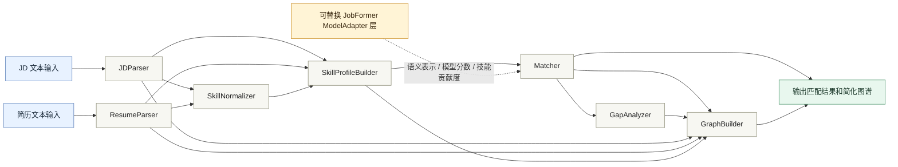

# 模块设计：第一阶段 Demo

## 1. 设计目标

第一阶段 Demo 面向单个岗位 JD 与单份简历的匹配闭环：

1. 输入 JD 原始文本和简历原始文本；
2. 解析出岗位要求、候选人能力与证据片段；
3. 标准化技能名称，构建岗位能力画像与候选人能力画像；
4. 计算匹配分数、命中技能、缺失技能和解释；
5. 输出可视化所需的岗位-简历-技能图谱数据。

本阶段只定义模块划分、数据流和接口契约，不编写业务实现。规则版算法作为 Demo 默认实现，后续可在不改上层流程的前提下替换为 JobFormer 式模型层。

## 2. 总体流程

系统架构图：



```text
JD Raw Text
  -> JDParser
  -> SkillNormalizer
  -> SkillProfileBuilder
  -> Matcher
  -> GapAnalyzer
  -> GraphBuilder

Resume Raw Text
  -> ResumeParser
  -> SkillNormalizer
  -> SkillProfileBuilder
  -> Matcher
  -> GapAnalyzer
  -> GraphBuilder

ModelAdapter
  -> 为 Matcher 提供可替换的语义表示、匹配分数、技能贡献度和解释特征
```

推荐调用顺序：

1. `JDParser.parse(jd_text)` 得到 `JDParseResult`；
2. `ResumeParser.parse(resume_text)` 得到 `ResumeParseResult`；
3. `SkillNormalizer.normalize(...)` 统一 JD 与简历中的技能表达；
4. `SkillProfileBuilder.build_job_profile(...)` 构建岗位能力画像；
5. `SkillProfileBuilder.build_resume_profile(...)` 构建候选人能力画像；
6. `ModelAdapter.predict(...)` 可选生成语义特征或模型分数；
7. `Matcher.match(...)` 生成最终匹配结果；
8. `GapAnalyzer.analyze(...)` 生成能力差距结果；
9. `GraphBuilder.build(...)` 生成图谱节点和边。

## 3. 通用数据契约

### 3.1 原始技能提及 SkillMention

用于表示解析阶段从 JD 或简历中抽取到的技能原始表达。

```text
SkillMention:
  raw_text: 原文中的技能表达，例如 "Pytorch"、"大模型"
  source_type: jd / resume
  source_section: 来源区块，例如 requirements / projects
  evidence_text: 支撑该技能的原文句子或条目
  position: 原文位置，可为空
  confidence: 抽取置信度，0-1
```

### 3.2 标准技能 NormalizedSkill

用于表示经过标准化后的技能。

```text
NormalizedSkill:
  skill_id: 标准技能 ID
  name: 标准技能名，例如 "PyTorch"、"大语言模型"
  skill_type: 编程语言 / 框架工具 / 算法能力 / 数据能力 / 工程能力 / 业务能力 / 通用能力
  aliases: 命中的别名列表
  relation_type: exact / alias / parent / child / related
  evidence_refs: 对应 SkillMention 的引用
  confidence: 标准化置信度，0-1
```

### 3.3 能力画像 SkillProfile

用于表示岗位或候选人的技能分布。

```text
SkillProfile:
  profile_id: 画像 ID
  profile_type: job / resume
  skills:
    - skill_id
      name
      skill_type
      weight: 岗位需求权重，适用于 job
      proficiency: 候选人熟练度，适用于 resume
      confidence
      evidence_refs
  vector: 技能分布向量，可为空
  metadata: 学历、年限、行业、岗位类别等结构化信息
```

## 4. 模块设计

### 4.1 JDParser

#### 职责

`JDParser` 负责将岗位 JD 原始文本解析为结构化岗位信息，重点保留条目级证据，为后续技能标准化、画像构建和解释生成提供输入。

#### 输入

```text
JDParserInput:
  text: JD 原始文本
  source_id: JD 来源 ID，可为空
  metadata: 来源渠道、发布时间、岗位城市等补充信息，可为空
```

#### 输出

```text
JDParseResult:
  job_title: 岗位名称
  job_category: 岗位类别
  responsibilities: 岗位职责条目列表
  requirements: 任职要求条目列表
  preferred: 加分项条目列表
  education_requirement: 学历要求
  experience_requirement: 年限要求
  domain_requirement: 行业或业务背景
  raw_skill_mentions: SkillMention 列表
  evidence_items: 条目级原文证据
  parse_warnings: 解析异常或低置信度字段
```

#### 建议接口

```text
parse(input: JDParserInput) -> JDParseResult
```

#### 后续扩展方式

1. 从纯文本扩展到 HTML、PDF、招聘网站页面等多源输入；
2. 增加区块识别模型，用模型替代标题关键词和规则切分；
3. 增加 JD 条目级编码结果，为 JobFormer 式岗位表示学习提供输入；
4. 增加岗位发布时间、企业、城市、薪资等字段，支持动态演化分析；
5. 增加解析质量评分，用于提示人工修正或低置信度兜底。

### 4.2 ResumeParser

#### 职责

`ResumeParser` 负责将简历原始文本解析为结构化候选人信息，识别教育经历、工作经历、项目经历、技能清单以及技能证据。

#### 输入

```text
ResumeParserInput:
  text: 简历原始文本
  source_id: 简历来源 ID，可为空
  metadata: 候选人 ID、投递时间、目标岗位等补充信息，可为空
```

#### 输出

```text
ResumeParseResult:
  candidate_id: 候选人 ID，可为空
  education: 最高学历或教育经历列表
  experience_years: 工作或项目年限
  target_position: 求职意向，可为空
  work_experiences: 工作经历条目列表
  projects: 项目经历条目列表
  certificates: 证书、论文、竞赛、开源成果等
  raw_skill_mentions: SkillMention 列表
  evidence_items: 条目级原文证据
  parse_warnings: 解析异常或低置信度字段
```

#### 建议接口

```text
parse(input: ResumeParserInput) -> ResumeParseResult
```

#### 后续扩展方式

1. 支持 PDF、Word、Markdown、招聘平台结构化简历等输入格式；
2. 增加时间线解析，计算技能最近使用时间和经历连续性；
3. 增加项目角色识别，区分主导、负责、参与、学习等贡献程度；
4. 增加成果强度识别，例如论文、专利、竞赛奖项、开源 star 数；
5. 接入简历去隐私化模块，保护姓名、电话、邮箱等个人信息。

### 4.3 SkillNormalizer

#### 职责

`SkillNormalizer` 负责将 JD 和简历中的技能原始表达映射到统一技能库，解决大小写、别名、同义词、上下位关系和相关技能关系问题。

#### 输入

```text
SkillNormalizerInput:
  skill_mentions: SkillMention 列表
  skill_catalog: 标准技能库
  alias_map: 技能别名映射
  relation_map: 技能上下位和相关关系，可为空
```

#### 输出

```text
SkillNormalizerOutput:
  normalized_skills: NormalizedSkill 列表
  unmatched_mentions: 未能标准化的 SkillMention 列表
  normalization_logs: 标准化过程说明，可用于调试
```

#### 建议接口

```text
normalize(input: SkillNormalizerInput) -> SkillNormalizerOutput
```

#### 后续扩展方式

1. 将静态词表升级为版本化技能本体，记录技能新增、合并、废弃历史；
2. 使用向量相似度或大模型辅助识别未登录技能；
3. 增加技能上下位推理，例如 "深度学习" 覆盖 "CNN"、"Transformer" 的部分能力；
4. 增加领域化技能库，例如 AI、后端、数据治理、招聘业务分别维护领域词表；
5. 支持人工审核回流，将 unmatched 技能沉淀为新别名或新技能。

### 4.4 SkillProfileBuilder

#### 职责

`SkillProfileBuilder` 负责将解析结果和标准技能转化为可匹配的岗位能力画像与候选人能力画像。岗位侧重点是需求权重，简历侧重点是熟练度、置信度和最近使用程度。

#### 输入

```text
JobProfileInput:
  jd_parse: JDParseResult
  normalized_skills: NormalizedSkill 列表

ResumeProfileInput:
  resume_parse: ResumeParseResult
  normalized_skills: NormalizedSkill 列表
```

#### 输出

```text
JobSkillProfile:
  profile_type: job
  job_title
  job_category
  education_requirement
  experience_requirement
  domain_requirement
  skills: 带 weight 的标准技能列表
  skill_distribution: 岗位技能权重分布

ResumeSkillProfile:
  profile_type: resume
  education
  experience_years
  domain_experiences
  skills: 带 proficiency、confidence、recency 的标准技能列表
  skill_distribution: 候选人技能能力分布
```

#### 建议接口

```text
build_job_profile(input: JobProfileInput) -> JobSkillProfile
build_resume_profile(input: ResumeProfileInput) -> ResumeSkillProfile
```

#### 后续扩展方式

1. 将规则权重升级为可学习权重，基于真实投递和录用反馈训练；
2. 增加时间维度画像，支持岗位技能需求和候选人能力演化分析；
3. 增加行业画像、岗位族画像、项目画像等多维分布；
4. 输出模型可直接消费的特征张量或稀疏向量；
5. 支持多个 JD 或多份简历的批量画像构建。

### 4.5 ModelAdapter

#### 职责

`ModelAdapter` 是可替换模型层的统一适配接口。Demo 阶段可以使用空实现、规则实现或轻量语义相似度实现；后续可替换为 JobFormer 模型层，而不影响 `Matcher`、`GapAnalyzer` 和 `GraphBuilder` 的上层接口。

`Matcher` 不直接依赖具体模型文件、checkpoint 或 JobFormer 类，只依赖 `ModelAdapter` 的统一输出。

#### 输入

```text
ModelAdapterInput:
  job_profile: JobSkillProfile
  resume_profile: ResumeSkillProfile
  jd_evidence_items: JD 条目级证据
  resume_evidence_items: 简历条目级证据
  skill_catalog: 标准技能库，可为空
  runtime_options:
    model_name: rule / semantic / jobformer
    return_embeddings: 是否返回向量
    return_explanations: 是否返回模型解释
```

#### 输出

```text
ModelAdapterOutput:
  semantic_score: JD 与简历语义匹配分，0-1
  job_embedding: 岗位向量，可为空
  resume_embedding: 简历向量，可为空
  skill_contributions:
    - skill_id
      contribution_score
      evidence_refs
  item_weights:
    - evidence_id
      weight
  model_explanation: 模型层解释文本或结构化解释，可为空
  model_metadata: 模型名称、版本、特征版本、耗时等
```

#### 建议接口

```text
predict(input: ModelAdapterInput) -> ModelAdapterOutput
```

#### 后续扩展方式

1. `RuleModelAdapter`：Demo 默认适配器，只返回规则语义分或空模型特征；
2. `EmbeddingModelAdapter`：接入通用文本向量，先替换 `SemanticFit`；
3. `JobFormerAdapter`：接入 JobFormer 式条目级 JD 编码、技能感知表示和匹配预测；
4. `RemoteModelAdapter`：通过 HTTP/gRPC 调用独立模型服务，便于模型部署和灰度；
5. `EnsembleModelAdapter`：融合规则分、向量召回分、JobFormer 排序分和图谱特征。

### 4.6 Matcher

#### 职责

`Matcher` 负责人岗匹配主流程，将岗位画像、简历画像和可选模型特征合成为最终匹配结果。它需要保持稳定的输入输出契约，使规则版和模型版可以平滑切换。

#### 输入

```text
MatcherInput:
  job_profile: JobSkillProfile
  resume_profile: ResumeSkillProfile
  model_output: ModelAdapterOutput，可为空
  scoring_config:
    skill_coverage_weight
    distribution_similarity_weight
    experience_fit_weight
    education_fit_weight
    domain_fit_weight
    semantic_fit_weight
    hard_penalty_config
```

#### 输出

```text
MatchResult:
  final_score: 0-100
  skill_coverage: 技能覆盖率
  distribution_similarity: 技能分布相似度
  experience_fit: 年限匹配分
  education_fit: 学历匹配分
  domain_fit: 行业背景匹配分
  semantic_fit: 语义匹配分
  matched_skills:
    - skill_id
      name
      match_type: exact / alias / related / inferred
      jd_weight
      resume_proficiency
      contribution
      evidence_refs
  missing_skills:
    - skill_id
      name
      jd_weight
      priority
      evidence_refs
  insufficient_skills:
    - skill_id
      name
      required_level
      resume_level
      evidence_refs
  hard_penalties:
    - reason
      penalty
  explanation: 可展示的匹配解释
```

#### 建议接口

```text
match(input: MatcherInput) -> MatchResult
```

#### 后续扩展方式

1. 从单 JD 单简历匹配扩展为批量候选人排序；
2. 增加两阶段框架：先向量召回，再深度精排；
3. 将手工评分权重升级为可配置实验参数或模型学习参数；
4. 引入岗位族、行业、薪资、地点、稳定性等非技能因素；
5. 支持 A/B 测试，对比 rule_based_matcher 与 jobformer_matcher 的排序效果。

### 4.7 GapAnalyzer

#### 职责

`GapAnalyzer` 负责在匹配结果基础上进行能力差距分析，输出缺失技能、技能不足、相关但不充分的能力项，以及面向展示或后续推荐的改进建议。

#### 输入

```text
GapAnalyzerInput:
  job_profile: JobSkillProfile
  resume_profile: ResumeSkillProfile
  match_result: MatchResult
  skill_relations: 技能上下位和相关关系，可为空
```

#### 输出

```text
GapAnalysisResult:
  missing_skills:
    - skill_id
      name
      priority: high / medium / low
      reason
      jd_evidence_refs
  insufficient_skills:
    - skill_id
      name
      required_level
      current_level
      reason
      resume_evidence_refs
  related_only_skills:
    - required_skill_id
      resume_related_skill_id
      relation_type
      reason
  improvement_suggestions:
    - skill_id
      suggestion
      priority
  gap_summary: 差距分析摘要
```

#### 建议接口

```text
analyze(input: GapAnalyzerInput) -> GapAnalysisResult
```

#### 后续扩展方式

1. 增加学习路径推荐，例如课程、项目练习、证书和资料；
2. 增加能力迁移分析，例如从 NLP 迁移到 RAG、从 SQL 迁移到数据治理；
3. 引入岗位族对比，分析候选人与目标岗位、相邻岗位之间的差距；
4. 结合时间维度，分析技能差距的紧急程度和市场热度变化；
5. 将人工反馈回流到技能关系和匹配权重中。

### 4.8 GraphBuilder

#### 职责

`GraphBuilder` 负责将解析结果、能力画像、匹配结果和差距分析转换为图谱数据结构，供前端可视化或后续图数据库写入。

#### 输入

```text
GraphBuilderInput:
  jd_parse: JDParseResult
  resume_parse: ResumeParseResult
  job_profile: JobSkillProfile
  resume_profile: ResumeSkillProfile
  match_result: MatchResult
  gap_analysis: GapAnalysisResult
```

#### 输出

```text
GraphData:
  nodes:
    - id
      type: Job / Resume / Skill / SkillType / Evidence
      label
      properties
  edges:
    - source
      target
      type: requires / has / belongs_to / related_to / evidenced_by / matches / lacks
      weight
      properties
  graph_metadata:
    created_at
    schema_version
    source_ids
```

#### 建议接口

```text
build(input: GraphBuilderInput) -> GraphData
```

#### 后续扩展方式

1. 从前端临时图数据扩展到 Neo4j、NebulaGraph 等图数据库写入；
2. 增加时间戳和版本号，支持动态演化分析；
3. 支持多岗位、多候选人、多企业、多行业的全局图谱构建；
4. 增加图谱推理边，例如 skill_transferable_to、job_similar_to；
5. 支持按展示场景裁剪图谱，例如只展示命中技能、只展示高优先级差距。

## 5. 模块依赖关系

```text
JDParser            -> SkillNormalizer -> SkillProfileBuilder
ResumeParser        -> SkillNormalizer -> SkillProfileBuilder
SkillProfileBuilder -> ModelAdapter    -> Matcher
SkillProfileBuilder --------------------> Matcher
Matcher             -> GapAnalyzer
Matcher             -> GraphBuilder
GapAnalyzer         -> GraphBuilder
```

依赖原则：

1. Parser 只负责解析和证据保留，不负责最终评分；
2. SkillNormalizer 只负责标准化，不决定技能权重；
3. SkillProfileBuilder 负责画像和分布，不负责最终匹配解释；
4. Matcher 可以使用 ModelAdapter，但不绑定具体模型实现；
5. GapAnalyzer 基于 MatchResult 做差距解释，避免重复计算匹配主逻辑；
6. GraphBuilder 只做图谱数据组装，不改写匹配结果。

## 6. Demo 阶段推荐目录规划

后续编写业务代码时，可按以下目录拆分：

```text
backend/
  main.py
algorithms/
  jd_parser.py
  resume_parser.py
  skill_normalizer.py
  skill_profile_builder.py
  matcher.py
  gap_analyzer.py
  graph_builder.py
  model_adapter.py
data/
  skills/
    skill_catalog.json
    skill_aliases.json
    skill_relations.json
```

该目录只是后续实现建议，本次文档不新增业务代码。

## 7. 与 JobFormer 可替换模型层的衔接

为了后续替换 JobFormer 模型层，当前接口需要提前保留以下能力：

1. JD 条目级证据：`JDParser` 输出 responsibilities、requirements、preferred 等条目；
2. 技能感知画像：`SkillProfileBuilder` 输出岗位技能权重分布和候选人技能能力分布；
3. 统一模型适配：`ModelAdapter` 输出 semantic_score、embedding、skill_contributions、item_weights；
4. 稳定匹配结果：`Matcher` 最终仍输出 final_score、matched_skills、missing_skills、insufficient_skills 和 explanation；
5. 可解释映射：模型贡献度必须能映射回技能和证据条目，供 GapAnalyzer 和 GraphBuilder 使用。

替换路径：

```text
Demo:
  RuleModelAdapter -> Matcher(rule scoring)

模型增强:
  EmbeddingModelAdapter -> Matcher(rule + semantic score)

JobFormer 版本:
  JobFormerAdapter -> Matcher(model score + rule constraints + explainable evidence)
```

这样设计后，JobFormer 只替换模型表示与匹配特征生成，不要求重写解析、图谱构建、差距分析和前端展示逻辑。
