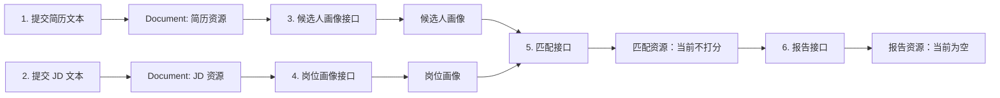

# 零基础项目导读与算法替换指南

这份文档写给两类人：

1. 还没有系统学过软件工程，但需要把项目讲明白的人；
2. 接下来要读论文、试算法、做比赛迭代的人。

读完后，你应该能回答四个问题：这个项目现在能做什么？还不能做什么？一份简历从输入到输出经过哪里？我找到一篇论文后，应该改哪个文件？

---

## 1. 先用一句话理解项目

项目最终想做的是：把简历、JD、政策/行业报告/招聘市场数据变成可追溯的结构化信息，再用知识图谱和检索证据支持人岗匹配、岗位发现和学习建议。

当前的 v3 版本还没有实现“智能分析”。它是一个**正式接口骨架**：

- 它能接收和临时保存五类文本；
- 它能创建“候选人画像”“岗位画像”“匹配结果”等资源的空壳；
- 它明确告诉调用方：当前返回的是 `mock`，不是算法结论；
- 它已经把未来替换 LLM、RAG、匹配算法的位置留好了，并且可以通过 `GRAPH_BACKEND=neo4j` 启用最小 Neo4j 知识图谱。

因此，看到 `state: "not_implemented"`、空列表或 `score: null` 是正常的。这不是报错，而是防止系统用假分数冒充真实能力。

---

## 2. 把系统想成一条“材料加工线”

可以把系统理解成一家尚未开工的“岗位研究工厂”。

| 现实中的东西 | 系统里的名字 | 当前状态 |
| --- | --- | --- |
| 收到简历、JD、政策报告 | Document（文档） | 已可用：仅内存保存 |
| 从原文提取技能、经历、职责 | Structured Extraction（结构化抽取） | 接口已留，尚未实现 |
| 把“Python3”“python”等归为 Python | Skill Normalization（技能归一化） | 接口已留，尚未实现 |
| 整理成候选人/岗位画像 | Profile Builder（画像构建） | 接口已留，尚未实现 |
| 从原文找依据段落 | Document RAG（文档检索） | 接口已留，尚未实现 |
| 保存岗位—技能—能力关系 | Knowledge Graph（知识图谱） | 默认 mock；可启用 Neo4j 最小实现 |
| 从图谱找关系和路径依据 | GraphRAG（图谱检索） | 默认 mock；可启用 Neo4j 路径检索 |
| 判断是否匹配、差在哪、怎么学 | Matching（匹配） | 接口已留，尚未实现 |
| 把结果写成报告 | Report Generation（报告生成） | 接口已留，尚未实现 |

这样设计的好处是：以后你换一种算法，不必把整个项目推倒重来，只要替换材料加工线中的一个工位。

---

## 3. 一次完整请求是怎样流动的

以“输入简历和 JD，获得人岗匹配结果”为例。当前系统能走完整流程，但中间的智能工位返回空的 mock 结果。



未来真正接入算法后，流程图不变；变化只发生在“画像”“匹配”“报告”这些方块的内部。

### 为什么每一步都返回一个 ID？

例如先创建简历后会返回 `doc_xxx`，再由它创建候选人画像会返回 `candidate_profile_xxx`。

这类似图书馆：

- `doc_xxx` 是一本原始材料的馆藏号；
- `candidate_profile_xxx` 是根据这本材料整理出的卡片；
- `match_xxx` 是把两张卡片对比后的分析任务记录。

后续 RAG、图谱和报告都用这些 ID 关联数据，不需要把简历原文在每个接口里重复发送。

---

## 4. 目录怎么读：先读哪里，后读哪里

不要从所有 Python 文件开始看。推荐按这个顺序：

1. [README.md](../README.md)：怎么启动，系统当前边界是什么。
2. [api-v3.md](api-v3.md)：系统有哪些接口，输入和输出长什么样。
3. `backend/app/main.py`：应用从这里启动；只负责把各部分装配起来。
4. `backend/app/api/v1/routes/`：每个接口的 HTTP 入口。这里不应该放算法。
5. `backend/app/application/use_cases/contract_facade.py`：一次业务流程如何调用各个能力。
6. `backend/app/domain/ports.py`：最重要的“插槽说明书”；以后换算法主要看这里。
7. `backend/app/infrastructure/mocks/adapters.py`：当前的占位实现；以后实际算法通常在这里的同级目录新增。
8. `backend/app/infrastructure/wiring.py`：决定系统启动时究竟使用 mock，还是使用真实算法。

目录职责可以简化为：

```text
api        = 接待员：收请求、回响应
application = 调度员：安排每个能力按顺序工作
domain     = 说明书：规定每个能力必须接收/返回什么
infrastructure = 工人：真正执行或目前暂时 mock 的地方
```

### 你暂时不需要深究的部分

- `schemas/`：接口输入检查规则，例如文本不能为空；它不是算法。
- `errors.py`：把错误统一包装为 JSON；它不是算法。
- `memory/repositories.py`：当前只在内存里临时存资源，重启会清空；它不是数据库方案。

---

## 5. 接口的最小使用方法

服务启动后访问 `http://127.0.0.1:8000/docs`，可以直接在网页里填写参数和试接口。

最常用的接口顺序：

| 顺序 | 接口 | 你传什么 | 你拿到什么 |
| --- | --- | --- | --- |
| 1 | `POST /api/v1/documents` | 文档类型和文本 | `document.id` |
| 2 | `POST /api/v1/candidate-profiles` | 简历 `document_id` | 候选人 `profile.id` |
| 3 | `POST /api/v1/job-profiles` | JD `document_id` | 岗位 `profile.id` |
| 4 | `POST /api/v1/matches` | 两个画像 ID | `match.id`，当前无分数 |
| 5 | `POST /api/v1/reports` | `match_id` | 报告资源，当前无章节 |

外部数据要用相同的文档入口，只是 `document_type` 换成：

- `policy`：政策文件；
- `industry_report`：行业研究报告；
- `market_data`：招聘市场数据；
- `jd`：招聘 JD；
- `resume`：候选人简历。

每个 `/api/v1` 成功响应都包在下面的外壳里：

```json
{
  "data": {"真正的结果放这里": "..."},
  "meta": {
    "request_id": "本次请求编号",
    "api_version": "v1",
    "implementation": "mock",
    "persistence": "memory"
  }
}
```

你在调试时，先看两个字段：

- `implementation`：`mock` 表示还没有接入真实能力；
- `state`：`not_implemented` 表示没有做推理，因此空结果不能被当成“没有技能”或“不匹配”。

---

## 6. 以后读论文，应该替换哪个地方

下面是最实用的对照表。读论文时先问：它解决的是哪一行问题？输入是什么？输出是什么？能否满足现有端口的输入输出？

| 你读到的论文/方法 | 它解决的问题 | 先看哪个端口 | 未来建议新增的实现文件 | 常用检索关键词 |
| --- | --- | --- | --- | --- |
| 本地 7B、信息抽取、函数调用、结构化输出 | 从简历/JD/报告提取字段与证据 | `StructuredExtractionPort` | `infrastructure/local_llm/extractor.py` | `LLM structured information extraction`, `schema constrained decoding`, `resume parsing` |
| 技能本体、实体链接、同义词消歧 | “PyTorch/Pytorch”是否同一技能，技能属于什么能力 | `SkillNormalizationPort` | `infrastructure/ontology/skill_normalizer.py` | `skill normalization`, `entity linking`, `skill ontology` |
| 画像表示学习、岗位表示学习、JobFormer | 由抽取结果形成候选人与岗位能力表示 | `ProfileBuilderPort` | `infrastructure/profiles/jobformer_builder.py` | `job representation learning`, `JobFormer`, `talent profile representation` |
| 向量检索、重排序、RAG | 从原文找可引用证据 | `DocumentRetrievalPort` | `infrastructure/rag/document_retriever.py` | `retrieval augmented generation`, `dense retrieval`, `reranking` |
| Neo4j、知识图谱构建、技能图谱 | 存储岗位—技能—能力—证据关系 | `KnowledgeGraphPort` | `infrastructure/neo4j/adapters.py` | `job skill knowledge graph`, `skill ontology`, `Neo4j` |
| GraphRAG、路径检索 | 从图谱找实体、关系和路径证据 | `GraphRetrievalPort` | `infrastructure/graph_rag/retriever.py` | `GraphRAG`, `knowledge graph retrieval`, `path reasoning` |
| 学习排序、可解释匹配、图神经网络 | 计算匹配度、差距、学习路径 | `MatchingPort` | `infrastructure/matching/graph_enhanced_matcher.py` | `person job matching`, `explainable recommendation`, `skill gap analysis` |
| 趋势检测、主题演化、新职业发现 | 从外部文档发现新岗位与能力变化 | `PositionEvolutionPort` | `infrastructure/evolution/analyzer.py` | `emerging occupation detection`, `job skill evolution`, `topic evolution` |
| RAG 报告、可解释生成 | 把结果组织成面向用户的报告 | `ReportGenerationPort` | `infrastructure/local_llm/report_generator.py` | `evidence grounded generation`, `RAG report generation` |

### 最重要的原则：先对齐输入输出，再接论文

不要因为某篇论文效果好，就直接把整套代码塞进项目。正确顺序是：

1. 写清楚论文算法需要什么输入，例如“JD 文本 + 简历文本 + 技能图谱”；
2. 写清楚它会输出什么，例如“匹配分数 + 技能贡献 + 证据 ID”；
3. 对照 `ports.py` 看现有端口是否能表达这些输入输出；
4. 先实现一个 adapter，让它满足端口；
5. 最后只在 `wiring.py` 中把 mock 换成真实 adapter。

这样接口和前端不需要跟着论文频繁重写。

---

## 7. 以“接入本地 7B 抽取”为例，具体改哪里

这是最推荐的第一项真实能力。

### 第一步：先定输出，不先写模型调用

简历抽取至少建议有：

```json
{
  "candidate": {"name": null, "target_position": null},
  "education": [],
  "experience": [],
  "skills": [],
  "projects": [],
  "evidence": []
}
```

其中每个技能都必须能指向 `evidence` 中的原文片段。比如：

```json
{
  "skill": "Python",
  "evidence_ids": ["ev_001"]
}
```

这条约束很关键：未来报告说“候选人会 Python”时，必须能回到简历原文解释“为什么这样判断”。

### 第二步：新增真实 adapter

新建类似 `backend/app/infrastructure/local_llm/extractor.py` 的文件，实现 `StructuredExtractionPort` 的 `extract(document)` 方法。

它的责任只有一件事：输入 `SourceDocument`，输出符合约定的字典。它不应该直接调用匹配接口、写 Neo4j、算分数或生成最终报告。

### 第三步：在装配处替换

当前 [wiring.py](../backend/app/infrastructure/wiring.py) 中有：

```python
extractor=MockStructuredExtractor()
```

真实实现完成并通过测试后，换成：

```python
extractor=LocalLLMStructuredExtractor(...)
```

其他路由和接口地址不用改变。这正是骨架存在的意义。

---

## 8. 先做什么，后做什么：比赛中的推荐顺序

不要同时启动所有模块。建议一层完成并可测试后，再进入下一层：

1. **数据与标注**：准备匿名简历、JD、外部文档；人工标出岗位、技能和原文证据。
2. **结构化抽取**：先接本地 7B，确保能稳定输出 JSON，并保留证据。
3. **技能归一化与画像**：建立小而可靠的技能词表/本体，不急于追求大而全。
4. **文档证据检索**：让每个结论都能回到原文。
5. **最小知识图谱**：先做岗位—技能—能力—证据四类节点与少量关系。
6. **匹配与差距**：先做有依据、可解释的规则或轻量基线，再尝试论文算法。
7. **GraphRAG、趋势发现、报告生成**：建立在前面数据和证据可靠的基础上。

如果时间很紧，优先做“简历 + JD → 结构化画像 + 原文证据 + 可解释差距”，这条链路比完整但空泛的 GraphRAG 更有比赛说服力。

---

## 9. 每读一篇论文，都填这张小卡片

建议在 `docs/论文阅读记录/` 下，每篇论文写一页。模板如下：

```text
论文题目：
要解决的问题：
与本项目哪一个端口对应：
论文输入：
论文输出：
需要的数据：
可采用的评价指标：
能否保留原文证据：
最小复现实验：
若有效，要替换 wiring.py 中的哪个 Mock：
风险/限制：
```

评价指标不要只看“模型分数高不高”。不同阶段应看不同指标：

| 模块 | 建议先看的指标 |
| --- | --- |
| 抽取 | 字段准确率、技能 Precision/Recall/F1、证据是否可追溯 |
| 归一化 | 同义词映射准确率、未识别技能比例 |
| 检索 | Recall@k、MRR、证据相关性人工抽查 |
| 匹配 | 排序指标、人工判断一致性、解释是否有证据支持 |
| 新岗位发现 | 人工确认率、时间窗口稳定性、证据覆盖度 |
| 报告 | 事实一致性、证据引用正确率、人工可读性 |

---

## 10. 最后几个容易踩的坑

- **不要把 mock 空数组当真实算法结果。** 空技能不等于候选人没有技能。
- **不要在路由里写算法。** 算法要放到新的 adapter 中，通过 `ports.py` 接入。
- **不要先做漂亮大前端。** 先保证数据、画像和证据正确；前端以后只消费稳定 API。
- **不要只保存结论，不保存证据。** 比赛答辩时，“这个结论依据哪段原文”很重要。
- **不要把真实简历写进仓库。** 当前系统只在内存保存，重启清空；测试数据应匿名化。
- **不要一开始追求图谱规模。** 小而正确、可展示证据的图谱，优先级高于大而无法验证的图谱。

现在你可以把 v3 看成一张干净的实验台：接口和插槽已经摆好。接下来每接入一篇论文或一个算法，做的都应该是“替换一个工位并评测它”，而不是重新造一遍系统。
