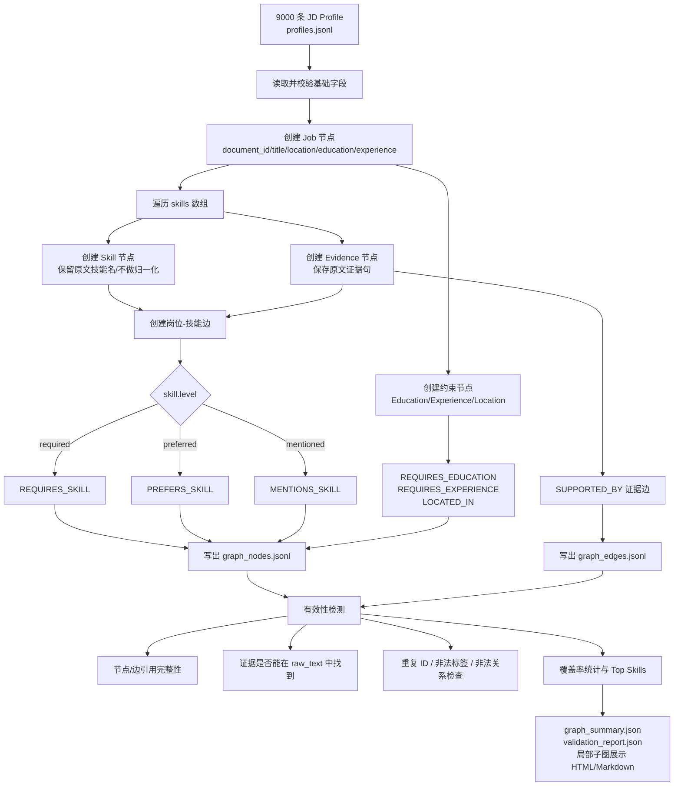

# JD 知识图谱构建流程图

```mermaid
flowchart TD
    A[9000 条 JD Profile<br/>profiles.jsonl] --> B[读取并校验基础字段]
    B --> C[创建 Job 节点<br/>document_id/title/location/education/experience]
    C --> D[遍历 skills 数组]
    D --> E[创建 Skill 节点<br/>保留原文技能名/不做归一化]
    D --> F[创建 Evidence 节点<br/>保存原文证据句]
    E --> G[创建岗位-技能边]
    F --> G
    G --> H{skill.level}
    H -->|required| H1[REQUIRES_SKILL]
    H -->|preferred| H2[PREFERS_SKILL]
    H -->|mentioned| H3[MENTIONS_SKILL]
    C --> I[创建约束节点<br/>Education/Experience/Location]
    I --> J[REQUIRES_EDUCATION<br/>REQUIRES_EXPERIENCE<br/>LOCATED_IN]
    F --> K[SUPPORTED_BY 证据边]
    H1 --> L[写出 graph_nodes.jsonl]
    H2 --> L
    H3 --> L
    J --> L
    K --> M[写出 graph_edges.jsonl]
    L --> N[有效性检测]
    M --> N
    N --> O[节点/边引用完整性]
    N --> P[证据是否能在 raw_text 中找到]
    N --> Q[重复 ID / 非法标签 / 非法关系检查]
    N --> R[覆盖率统计与 Top Skills]
    R --> S[graph_summary.json<br/>validation_report.json<br/>局部子图展示 HTML/Markdown]
```

说明：图谱构建只使用 `jd_profile_v1` 中已经抽取出的事实，不新增模型推断信息。技能节点保留原始表面形式；如后续要合并 `PyTorch / pytorch / torch框架`，应增加独立的技能归一化模块。
