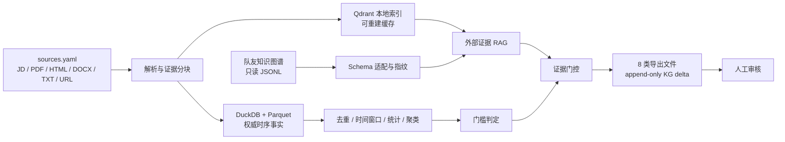

# 架构与责任边界

`trend-discovery-service` 是独立、可移交的批处理模块。它通过文件协议与其他队员集成，不导入对方 Python 包，也不向对方项目目录写入任何文件。

## 不可变约束

- `published_at` 是来源声称的发布时间，`collected_at` 是本系统实际观测时间，两者不互相代替。趋势的事件时间可使用 `published_at`，但新岗位的连续周快照**只能**由 `collected_at` 计算；同一次回填采集的旧 JD 不能伪造多周持续性。若输入带 `metadata.snapshot_week` 或日期型 `metadata.snapshot_id`，仅在其规范化后与 `collected_at` 所在周一致时保留，其他值回退到采集周。
- 政策和报告只用于前置信号及交叉验证，不计入招聘需求量。
- 归一化只允许大小写折叠、人工别名与已批准映射自动连接图谱。语义相似只能生成审核候选。
- 新岗位是统计门槛的输出；大模型只负责对已过门槛聚簇生成结构化定义。
- 任何未知证据 ID、无原文支持技能或统计不一致，均使整条结果进入 `needs_review`。
- `kg_link_delta.jsonl` 只引用基线节点 ID，从不重新计算对方 ID，从不自动合并。

## 本地数据层

Parquet 是交换和重建的权威事实源，DuckDB 用于查询与增量状态。Qdrant 仅是可丢弃、可重建的检索索引。每次运行都在 `runs/<run_id>/manifest.json` 记录输入输出 SHA-256、图谱指纹、模型/Prompt 版本、窗口、数量及费用。

## 云调用边界

`prepare` 只生成可审查的 Batch JSONL，默认不产生费用。`submit` 必须同时提供 `--execute` 和固定确认文本。没有 `DASHSCOPE_API_KEY` 时，解析、去重、统计、图谱导入、审核和缓存回放仍可运行。
